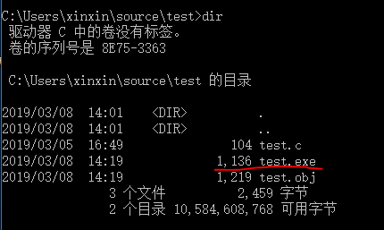
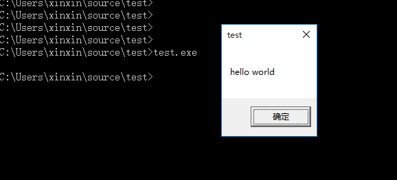
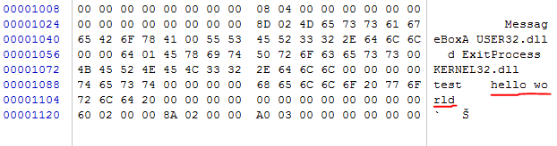
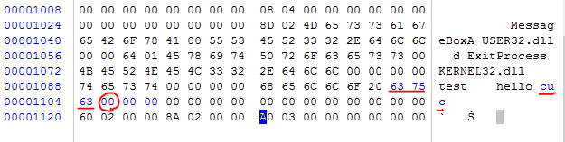
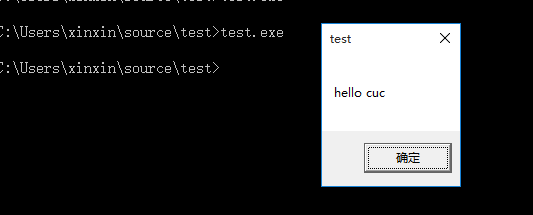
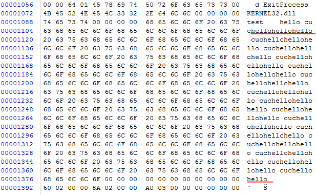
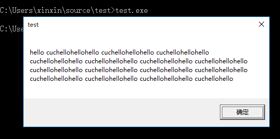

## 实验目的

1. 编写一个release版本的 hello world 程序。通过修改程序可执行文件的方式（不是修改源代码），使得程序运行后显示的内容不为hello world，变成 hello cuc！(提示：一定要在编译选项中将调试信息相关的编译连接选项去掉，否则程序体积会比较大，而且存在很多“干扰”信息。)


2. 上一题的程序中，修改的显示内容变为一个很长的字符串（至少2kb长）。并且保证程序正常运行不崩溃。(提示，可执行文件中原有的空间有限，必须要新加入数据，加入数据后必须要修改.text字段中的指针。)


## 实验过程

### 将hello world变为hello cuc

1. 写一个简单的hello world程序命名为test.c。

   ```c
   #include <windows.h>
   
   int main(){
   	MessageBoxA(NULL,"hello world","test",NULL);
   	ExitProcess(0);
   }
   ```

2. 打开vs2017命令行，对test.c文件进行编译链接生成可执行文件。

   ```c
   编译：
   cl /c /o1 test.c.   --生成test.obj
   链接：
   link /nologo /ENTRY:main /NODEFAULTLIB /SUBSYSTEM:WINDOWS /ALIGN:16 user32.lib kernel32.lib test.obj   --生成test.exe
   ```

3. 查看目录，发现生成了1136字节的exe文件。



4. 运行test.exe，弹出hello world的消息框。

   

5. 打开winhex。打开test.exe。

   

6. 找到hello world字符串，将world直接修改为cuc，再把后一个字节改为00。

   

7. 保存修改后的文件，再次执行test.exe，可以看到此时弹出hello cuc的消息框。

   


### 修改的显示内容变为一个很长的字符串(至少2kb)

1. 在winhex中在原有字符串后面增加任意字符，以00结尾。

   

2. 保存修改后的文件，再次执行test.exe，可以看到此时弹出长消息字符串的消息框。

   