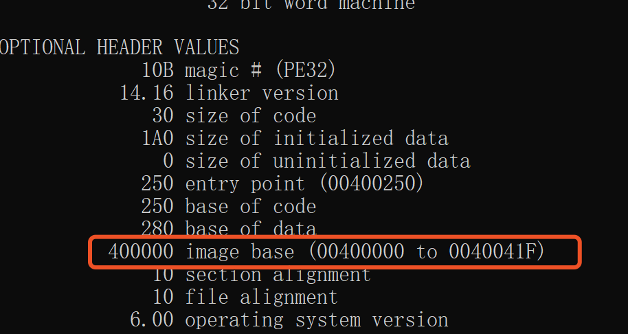

## 实验目的

2. 上一题的程序中，修改的显示内容变为一个很长的字符串（至少2kb长）。并且保证程序正常运行不崩溃。(提示，可执行文件中原有的空间有限，必须要新加入数据，加入数据后必须要修改.text字段中的指针。)

## 实验过程

### 修改的显示内容变为一个很长的字符串(至少2kb)

- 查看PE文件头。`dumpbin /headers test.exe`。其中基地址(ImageBase)为「0000000140000000h」。

  

  

- 查看反汇编。`dumpbin /disasm test.exe`。其中「0000000140000440h」对应字符串“test”；「0000000140000448h」对应“hello cuc”。根据基地址，计算出“test”的地址为：0000000140000440h-0000000140000000h=440h；“hello cuc”的地址为：0000000140000448h-0000000140000000h=448h；

  

- 在winhex中查看二进制文件，验证偏移地址。

  

  

- 在winhex中在原有字符串后面增加任意字符，以00结尾。

- 保存修改后的文件，再次执行test.exe，可以看到此时弹出长消息字符串的消息框。

