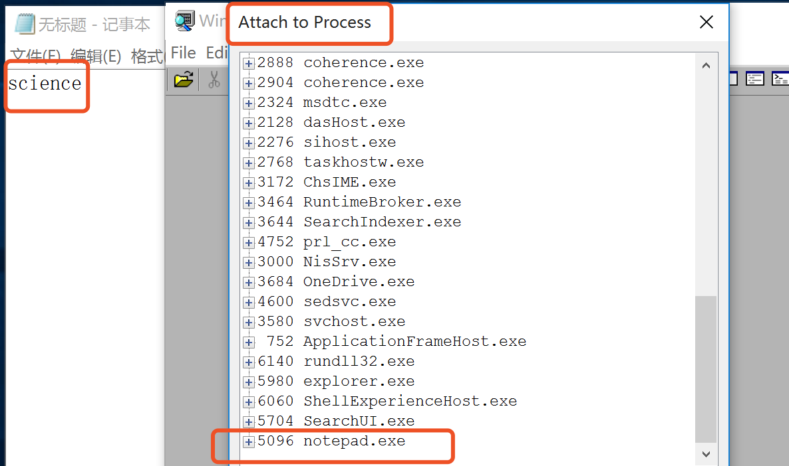
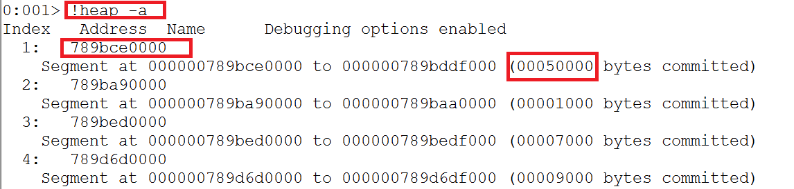
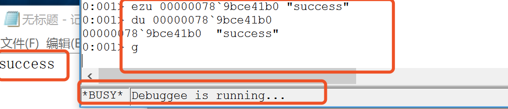

## 实验目的

3、在notepad（32位64位均可）中，输入一段文字。然后使用调试器，在内存中修改这段文字。使得没有在界面操作notepad的修改文字的情况下。notepad中显示的文字变化。

提示，在调试器中定位控件缓存的内存地址，可以用搜索、逆向、消息截获分析、API截获分析等方法。

## 实验过程

#### 使用windbg修改内存

- 打开notepad，输入字符串“science”。

- 打开windbg，附加notepad进程。（依次点击***File > Attach to a Process > notepad.exe***）

  

- 查看进程堆状态，找出字符串所在的位置。

  

- 进程目前用了4个堆，先选第一个试试，s命令用于搜索内存地址。

  

- 看起来找到了相似的字符串。使用du确认是否是我们输入的字符串。

  

- 经过确认，地址00000078就是字符串“science”的首地址，接下来修改内容。

- ```bash
  # 列出当前进程的所有堆
  !heap -a(/-h)
  
  # 搜索内存地址。查找字符串
  s -u 789bce0000 L00050000 "science"
  
  # 显示Unicode字符
  du 00000078`9bce41b0
  ```

- 对地址00000078位置的数据进行修改。

  

- 此时，notepad中的内容已经成功自动修改为“success”。

  ```bash
  # 修改字符串
  ezu 0000026f`f608d600 "success"
  
  # 显示Unicode字符
  du 00000078`9bce41b0
  
  # 继续运行程序
  g
  ```

  