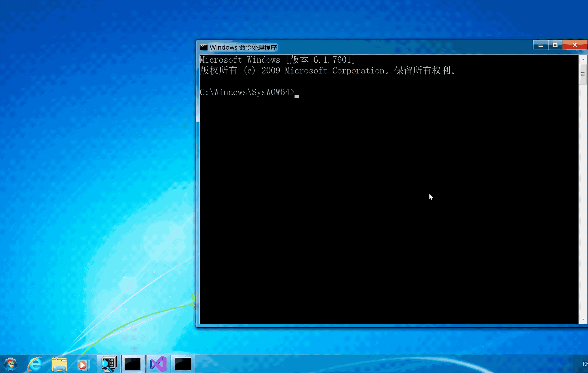

## 一. 实验目的

5. 通过API hook的方法，在每次notepad保存txt文件时，就将文件内容修改为： “you have been hacked!” 

   提示： API hook 的关键是编写一个假函数，用假函数的指针替换IAT中真函数的指针（当然这种方式只能对通过IAT调用的管用，但是够了。）在假函数调用真函数，修改真函数的参数和返回的数据，将修改后的数据返回给调用者。

## 二. 实验思路

- 通过IAT HOOK的方式，写一个假的WriteFile函数，使用远程注入的方式，用假函数的指针替换IAT中真函数的指针。

  ```c++
  BOOL WriteFile(
    HANDLE       hFile,
    LPCVOID      lpBuffer,
    DWORD        nNumberOfBytesToWrite,
    LPDWORD      lpNumberOfBytesWritten,
    LPOVERLAPPED lpOverlapped
  );
  ```

  参照以上函数原型编写假的函数。

## 三. 实验过程

- `IATHook.cpp`
  - 用写好的IAT函数编写自己需要的。按照WriteFile的函数原型，编写一个假的WriteFile函数——在文件中写入 “you have been hacked!” ，替换IAT中真函数的指针。
  - 生成一个IATHook.dll
- 编写远程注入函数`Inject.cpp`
  - 枚举进程，得到所有进程ID
  - 判断进程是否为notepad.exe，如果是，加载DLL。
  - DLL：
    - 打开进程
    - 分配远程空间
    - 把DLL的名字变量地址写入到远程空间中
    - 获取远程进程地址空间中LoadLibrary函数的地址
    - 创建远程线程
    - 等待远程线程执行结束(非必要)

## 四. 实验结果



## 五. 参考

1. [远程线程Dll注入](https://www.cnblogs.com/17bdw/p/6527998.html)
2. [tinysec/iathook](https://github.com/tinysec/iathook)

