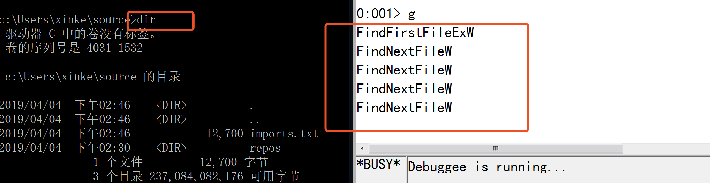
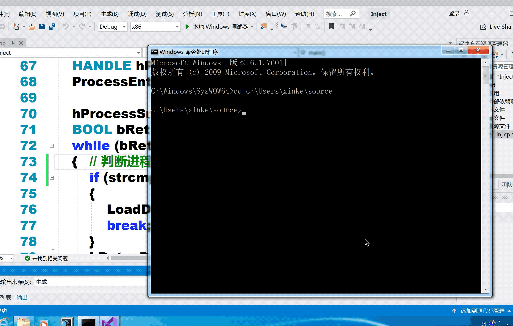

## 一. 实验目的

6. 通过API hook的方法，使得cmd的dir命令看不到任意目录下的hacker.exe.

## 二. 实验思路

- 查看`cmd.exe`的导入表。`dumpbin /imports cmd.exe > imports.txt`.

- 发现以下三个与查找文件有关的函数。

  ```bash
  KERNEL32.dll
  	77E3764B    133 FindFirstFileExW
  	77E2963A    144 FindNextFileW
    77E353B2    138 FindFirstFileW
  ```

- 打开windbg，分别对这三个函数下断点，调试在执行dir命令时哪些函数被执行了。

  ```bash
  0:000> bp FindFirstFileExW ".echo FindFirstFileExW;g"
  0:000> bp FindNextFileW ".echo FindNextFileW;g"
  0:000> bp FindFirstFileW ".echo FindFirstFileW;g"
  
  0:000> bl
   0 e 7632185e     0001 (0001)  0:**** kernel32!FindFirstFileExW ".echo FindFirstFileExW;g"
   1 e 76315eeb     0001 (0001)  0:**** kernel32!FindNextFileW ".echo FindNextFileW;g"
   2 e 76314499     0001 (0001)  0:**** kernel32!FindFirstFileW ".echo FindFirstFileW;g"
  ```

- `g`执行`cmd.exe`，执行`dir`命令查看当前目录下的文件。

  

- 可以发现在执行dir命令时，使用了一次FindFirstFileExW和多次FindNextFileW函数。

  ```c++
  HANDLE FindFirstFileExW(
    LPCWSTR            lpFileName,
    FINDEX_INFO_LEVELS fInfoLevelId,
    LPVOID             lpFindFileData,
    FINDEX_SEARCH_OPS  fSearchOp,
    LPVOID             lpSearchFilter,
    DWORD              dwAdditionalFlags
  );
  
  BOOL FindNextFileA(
    HANDLE             hFindFile,
    LPWIN32_FIND_DATAA lpFindFileData
  );
  ```


- 分析函数原型，可以知道:
  - `lpFindFileData`：A pointer to the buffer that receives the file data.
- 因此，当FindFirstFileExW函数找到名为`hacker.exe`的文件时，就跳过该文件，直接FindNextFileA下一个文件。

## 三. 实验过程

- 改写实验5的`IATHook.cpp`，编写假的FindFirstFileExW函数。
- 注入程序`Inject.cpp`不变。

## 四. 实验结果


