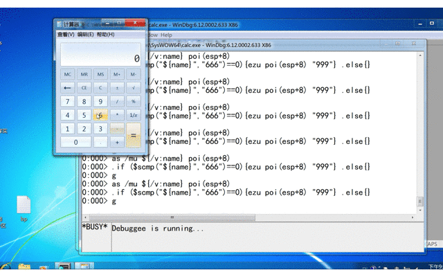

## 实验目的

4. 通过调试器监控计算器程序的运行，每当运行结果为666时，就改为999。

   提示：找到运行结果在内存中保存的地址。监控 “=” 按键消息等。

## 实验过程

- SetWindowTextW函数：设置对话框控件文本的内容，向对话框中的控件发送消息。

  ```c++
  BOOL SetWindowTextW(
    HWND    hWnd, //要改变文本内容的窗口或控件的句柄。 DWORD
    LPCWSTR lpString  //指向一个空结束的字符串的指针，该字符串将作为窗口或控件的新文本。 DWORD
  );
  ```

- 使用Windbg编写脚本。

  ```c++
  // /mu 参数指定的内存地址当做Unicode字符串。${}是别名解释器
  as /mu ${/v:modify} poi(esp+8)  //两个DWORD总共8字节，所以这里的内存地址取esp+8.
  
  // 对该断点给一个特定条件：如果这个字符串=“666”就修改为“999”
  // $scmp函数参数只接受字符串。
  .if ($scmp("${modify}","666")==0){ezu poi(esp+8) "999"} .else{}
  
  g
  ```

- 将该脚本保存为`bp.txt`，并在Windbg中下条件断点。

  ```c++
  // C:\\symbols\\bp.txt 这里是本地脚本的路径
  bp SetWindowTextW "$<C:\\symbols\\bp.txt"  
  ```

- Debug -> Go 运行程序，输入666，发现自动变成999，实验成功。

## 实验结果



## 参考

1. [windbg 脚本编写 -- 条件断点](https://blog.csdn.net/traceme2011/article/details/79421833)