# 符号执行
- 符号执行就是在运行程序时，用符号来代替真实值。符号执行相较于真实值执行的优点在于，当使用真实值执行程序时，我们能够遍历的程序路径只有一条，而使用符号进行执行时，由于符号是可变的，我们就可以利用这一特性，尽可能的将程序的每一条路径遍历，这样的话，必定存在至少一条能够输出正确结果的分支，每一条分支的结果都可以表示为一个离散关系式，使用约束求解引擎即可分析出正确结果。

## z3

- [Z3](https://github.com/Z3Prover/z3) 是一个由微软开发的可满足性摸理论（Satisfiability Modulo Theories，SMT）的约束求解器。所谓约束求解器就是用户使用某种特定的语言描述对象（变量）的约束条件，求解器将试图求解出能够满足所有约束条件的每个变量的值。Z3 可以用来检查满足一个或多个理论的公式的可满足性，也就是说,它可以自动化地通过内置理论对一阶逻辑多种排列进行可满足性校验。目前其支持的理论有：
- equality over free 函数和谓词符号
  - 实数和整形运算(有限支持非线性运算)
  - 位向量
  - 阵列
  - 元组/记录/枚举类型和代数（递归）数据类型
  - ...
- 因其强大的功能，Z3 已经被用于许多领域中，在安全领域，主要见于符号执行、Fuzzing、二进制逆向、密码学等。另外 Z3 提供了多种语言的接口，这里我们使用 Python。

### z3 Types

- BitVec：特定大小的数据类型
- BitVec("x"，32)：对应C语言中的int
- BitVec("x"，32)：对应C语言中的char
- Int
- Real
- Bool

- 注：
  - z3没有signed/unsigned类型
  - 使用<,<=,>,>=,/,%,>>操作signed类型变量
  - 使用ULT，ULE，UGT，UGE，UDIV，Uremand，LShR操作unsigned类型变量
  - 将BitVec的大小设成运算过程中最大的那个

### z3的简单实例

- 一个简单的例子：

  ```python
  from z3 import *
  x = Int('x')
  y = Int('y')
  solve(x > 2, y < 10, x + 2*y == 7)
  
  Output：[y = 0, x = 7]
  ```

- 解一个简单的二元一次方程组

  ```python
  from z3 import *
  
  x = Real('x')
  y = Real('y')
  s = Solver()
  s.add(x + y == 6)
  s.add(2 * x == (3 * y) + 6)
  if s.check() == sat:
      m = s.model()
      print(m)
  else:
      print("unsat")
      
  Output：[y = 6/5, x = 24/5]
  ```

### z3解题

1. 小李的弟弟比小李小2岁，小王的哥哥比小王大2岁，比小李大5岁。1994年，小李的弟弟和小王的年龄之和为15。问2019年小李与小王的年龄分别为多少岁

   ```python
   from z3 import *
   
   xl = Real('xl')
   xld = Real('xld')
   xw = Real('xw')
   xwg = Real('xwg')
   
   s = Solver()
   s.add(xl - xld == 2)
   s.add(xwg - xw == 2)
   s.add(xwg - xl == 5)
   s.add(xld - 25 + xw - 25 == 15)
   if s.check() == sat:
       m = s.model()
       print(m)
   else:
       print("unsat")
    
   Output：[xl = 32, xw = 35, xld = 30, xwg = 37]
   ```

2. 要求输入一段 20 个数字构成的序列号，然后程序会对序列号的每一位进行验证，以满足各种要求。`question.py`.

   ```python
   import sys
   print ("Please enter a valid serial number from your RoboCorpIntergalactic purchase")
   if len(sys.argv) < 2:
     print ("Usage: %s [serial number]"%sys.argv[0])
     exit()
     
   print ("#>" + sys.argv[1] + "<#")
   
   def check_serial(serial):
     if (not set(serial).issubset(set(map(str,range(10))))):
       print ("only numbers allowed")
       return False
     if len(serial) != 20:
       return False
     if int(serial[15]) + int(serial[4]) != 10:
       return False
     if int(serial[1]) * int(serial[18]) != 2:
       return False
     if int(serial[15]) / int(serial[9]) != 1:
       return False
     if int(serial[17]) - int(serial[0]) != 4:
       return False
     if int(serial[5]) - int(serial[17]) != -1:
       return False
     if int(serial[15]) - int(serial[1]) != 5:
       return False
     if int(serial[1]) * int(serial[10]) != 18:
       return False
     if int(serial[8]) + int(serial[13]) != 14:
       return False
     if int(serial[18]) * int(serial[8]) != 5:
       return False
     if int(serial[4]) * int(serial[11]) != 0:
       return False
     if int(serial[8]) + int(serial[9]) != 12:
       return False
     if int(serial[12]) - int(serial[19]) != 1:
       return False
     if int(serial[9]) % int(serial[17]) != 7:
       return False
     if int(serial[14]) * int(serial[16]) != 40:
       return False
     if int(serial[7]) - int(serial[4]) != 1:
       return False
     if int(serial[6]) + int(serial[0]) != 6:
       return False
     if int(serial[2]) - int(serial[16]) != 0:
       return False
     if int(serial[4]) - int(serial[6]) != 1:
       return False
     if int(serial[0]) % int(serial[5]) != 4:
       return False
     if int(serial[5]) * int(serial[11]) != 0:
       return False
     if int(serial[10]) % int(serial[15]) != 2:
       return False
     if int(serial[11]) / int(serial[3]) != 0:
       return False
     if int(serial[14]) - int(serial[13]) != -4:
       return False
     if int(serial[18]) + int(serial[19]) != 3:
       return False
     return True
   
   if check_serial(sys.argv[1]):
     print ("Thank you! Your product has been verified!")
   else:
     print ("I'm sorry that is incorrect. Please use a valid RoboCorpIntergalactic serial number")
   ```

   - 首先创建一个求解器实例，然后将序列的每个数字定义为常量：

     ```python
     solver = Solver()
     serial = [Int("serial[%d]" % i) for i in range(20)]
     ```

   - 接着定义约束条件，注意，除了题目代码里的条件外，还有一些隐藏的条件，比如：

     ```python
     solver.add(serial[11] / serial[3]  == 0)
     ```

   - 因为被除数不能为 0，所以 `serial[3]` 不能为 0。另外，每个序列号数字都是大于等于 0，小于 9 的。

     ```python
     solver.add(serial[3] != 0)
     
     for i in range(20):
         solver.add(serial[i] >= 0, serial[i] < 10)
     ```

   - 完整解题过程：`exp.py`。最后得出结果：

     ```python
     $ python exp.py
     The valid RoboCorpIntergalactic serial number is 42893724579039578812
     $ python question.py 42893724579039578812
     Please enter a valid serial number from your RoboCorpIntergalactic purchase
     #>42893724579039578812<#
     Thank you! Your product has been verified!
     ```

3. 逆向求解：I forgot my flag & key. Help me recover them. `misc.py`

   `5616f5962674d26741d2810600a6c5647620c4e3d2870177f09716b2379012c342d3b584c5672195d653722443f1c39254360007010381b721c741a532b03504d2849382d375c0d6806251a2946335a67365020100f160f17640c6a05583f49645d3b557856221b2`

   ```php
   function my_encrypt($flag, $key) {
     $key = md5($key);
     $message = $flag . "|" . $key;
   
     $encrypted = chr(rand(0, 126));
     for($i=0;$i<strlen($message);$i++) {
       $encrypted .= chr((ord($message[$i]) + ord($key[$i % strlen($key)]) + ord($encrypted[$i])) % 126);
     }
     $hexstr = unpack('h*', $encrypted);
     return array_shift($hexstr);
   }
   ```

   - 可以看出，题目给了一个加密函数，给出了密文，要求还原 flag 和 key。

   - 加密串每一位都与明文、key、和加密串的前一位相关。但是由于第一位是随机出来的，所以很难从开头递推出来。

   - 从`$message`的构成可以看出，前n位是`$flag`，倒数第33位是`|`，最后32位是`$key`的md5值。

   - 先算未经unpack解包之前的加密后的字符串的ASCII码（十进制）。「注：字符e的十进制ASCII码为101，十六进制为65，`unpack('h*', 'e') = 56`，即低位在前高位在后。」

     ```python
     encrypted = []
     for i in range(0, len(s), 2):
         encrypted.append(binascii.unhexlify(s[i+1] + s[i])[0])
     ```

   - 创建一个求解器

     ```python
     solver = Solver()
     ```

   - 添加明文字符的约束条件

     ```python
     ml = len(encrypted) - 1
     for i in range(ml):
         if i == ml - 33:
             solver.add(message[i] == ord('|'))
         else:
             # 肯定是可见字符，因此限定范围如下
             solver.add(message[i] < 127)
             solver.add(message[i] >= 32)
     ```

   - 添加明文和密文对照关系的约束条件

     ```python
     for i in range(ml):
         solver.add(encrypted[i+1] == (message[i] + message[ml-32+i%32] + encrypted[i]) % 126)
     
     ```

   - 检查是否有解，有解则输出。

     ```python
     if solver.check() == sat:
         m = solver.model()
         s = []
         for i in range(ml):
             s.append(m[message[i]].as_long())
         print(bytes(s))
     else:
         print('unsat')
     ```

## KLEE

- klee是通过对llvm bitcode进行解释以实现符号执行的工具。它通过插入函数调用（klee_make_symbolic）对内存进行符号化。并且会跟踪符号内存的使用，并收集使用这些符号内存的约束。如果有使用前面符号内存的其他内存，那么该内存也将会被符号化。当遇到一个使用符号化内存的分支时，KLEE会将执行状态一分为二，看看分支的哪一边可以找到一个可以满足符号约束的解。KLEE使用STP来求解这些符号约束。

### 安装

```bash
# Ubuntu18.04利用Docker安装KLEE
docker pull klee/klee

# 创建临时画像
docker run --rm -ti --ulimit='stack=-1:-1' klee/klee

klee@6482b3b13ca1:~$ ls
klee_build  klee_src

klee@6482b3b13ca1:~$ klee --version
KLEE 2.0 (https://klee.github.io)
  Build mode: RelWithDebInfo (Asserts: TRUE)
  Build revision: 2634250dd3bd7aae225a80e4f024874752432752

LLVM (http://llvm.org/):
  LLVM version 6.0.1
  Optimized build with assertions.
  Default target: x86_64-unknown-linux-gnu
  Host CPU: skylake

klee@6482b3b13ca1:~$ clang --version
clang version 6.0.1 (branches/release_60 355598)
Target: x86_64-unknown-linux-gnu
Thread model: posix
InstalledDir: /tmp/llvm-60-install_O_D_A/bin

```

### 实例

- `get_sign.c`：测试一个判断正负数的程序。

  ```c
  #include <klee/klee.h>
  
  int get_sign(int x) {
    if (x == 0)
       return 0;
    
    if (x < 0)
       return -1;
    else 
       return 1;
  } 
  
  int main() {
    int a;
    klee_make_symbolic(&a, sizeof(a), "a");
    return get_sign(a);
  } 
  ```

  - 其中klee_make_symbolic是KLEE工具自带的测试函数，通过自定义的变量，不断产生值赋给a，以此完成自动生成样例功能。

  - 编译c文件：

    ```bash
    $ clang -I ../../include -emit-llvm -c -g get_sign.c
    ```

  - 同目录下生成了一个get_sign.bc字节码文件，然后进行测试：

    ```bash
    $ klee get_sign.bc
    ```

  - 输出结果

    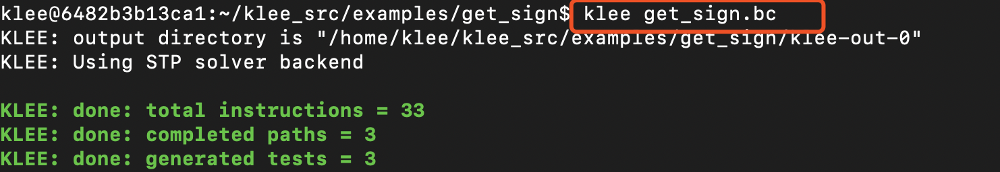
    
  - 查看生成结果。扩展名为.ktest的都是生成的测试例，这个程序有三条path，所以三个测试例，这些文件都是二进制代码，可以用ktest-tool命令查看
  
    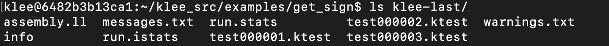
    
    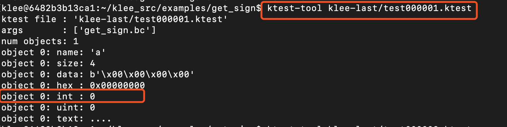
    
    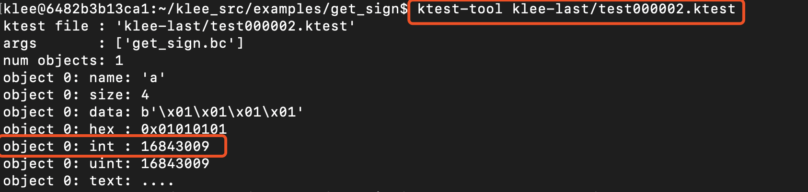
    
    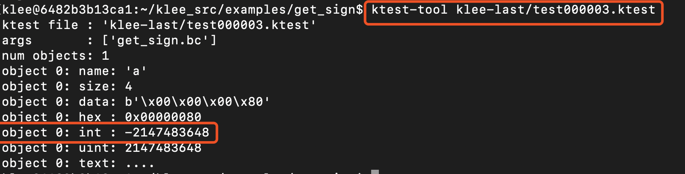

- 一个缺陷程序。`mytest.c`

  ```c
  #include <klee/klee.h>
  #include<stdio.h>
  #include<stdlib.h>
  
  void kleeTest(int a){
  	int arr[10];
  	int d[10];
  
  	for (int i = 0; i < 10; i++){ //赋初始值
  		arr[i] = i;
  	}
  
  	if (a < -50){  //求余分母为0
  		for (int i = 0; i < 10; i++){
  			int num = i;
  			d[i] = arr[i] % num;
  		}
  	}
  	else if(a < -25){  //除法分母为0
  		for (int i = 0; i <= 10; i++){
  			int num = i ;
  			d[i] = arr[i] / num;
  		}
  	}
  	else if (a < 0){  //数组越界
  		for(int i = 0; i<= 11; i++){
  			arr[i] = i;
  		}
  	}
  	else if (a < 25){  //空指针
  		int *a = NULL;
  		int b = *a + 1;
  	}
  	else if(a < 50){  //内存泄漏
  		free(arr);
  	}
  }
  
  int main(){
  	int n;
  	klee_make_symbolic(&n, sizeof(n), "n");
  	kleeTest(n);
  	return 0;
  }
  ```

  - 编译c文件：

    ```bash
    clang -I ../../include -emit-llvm -c -g mytest.c
    ```

  - 同目录下生成了一个mytest.bc字节码文件，然后进行测试：

    ```bash
    klee mytest.bc
    ```

  - 输出结果：

    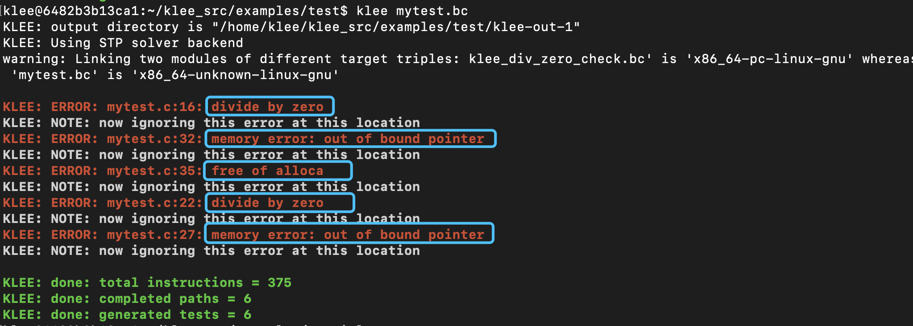

### 迷宫求解

- 一个简单的迷宫，起始点X，终点#，'w', 's', 'a' , 'd'控制上下左右。

```
                                  +-+---+---+
                                  |X|     |#|
                                  | | --+ | |
                                  | |   | | |
                                  | +-- | | |
                                  |     |   |
                                  +-----+---+
```

- `maze.c`。当成功到达#时：

  ```c
  printf ("You win!\n");
  klee_assert(0);  //Signal The solution!!
  ```

- 编译c文件：

  ```bash
  clang -I ../../include -emit-llvm -c -g maze.c
  ```

- 同目录下生成了一个mazet.bc字节码文件，然后进行测试：

  ```bash
  klee maze.bc
  ```

- 输入以下命令，发现结果有四条`KLEE: ERROR: maze.c:59: ASSERTION FAIL: 0`，说明有四组正确解。

  ```
  klee --emit-all-errors maze.bc
  ```

- 查看含有error的文件，就是成功解。`ls -1 klee-last/ |grep -A2 -B2 err`

  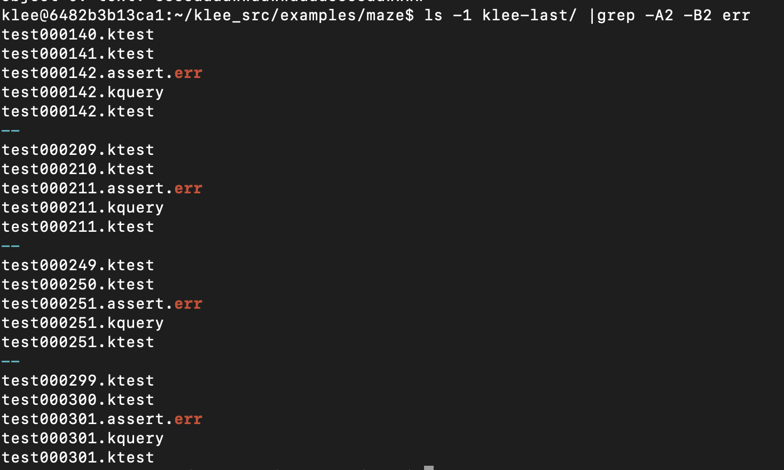

- 输出结果：

  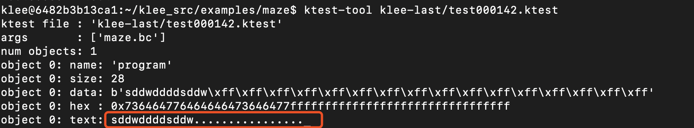

  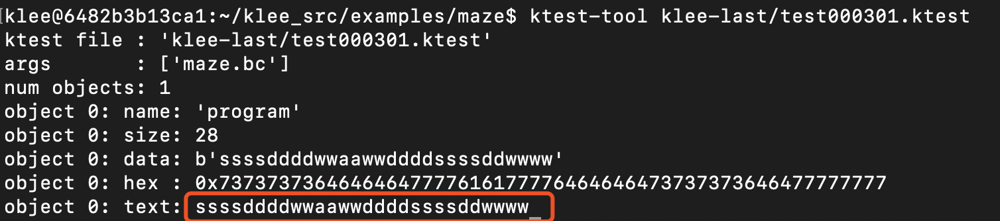

  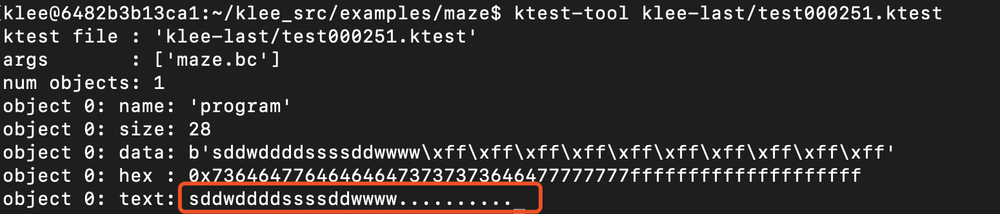

  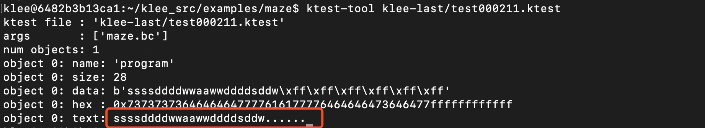

- 用visual stdio手工验证，发现四个解都是正确的。